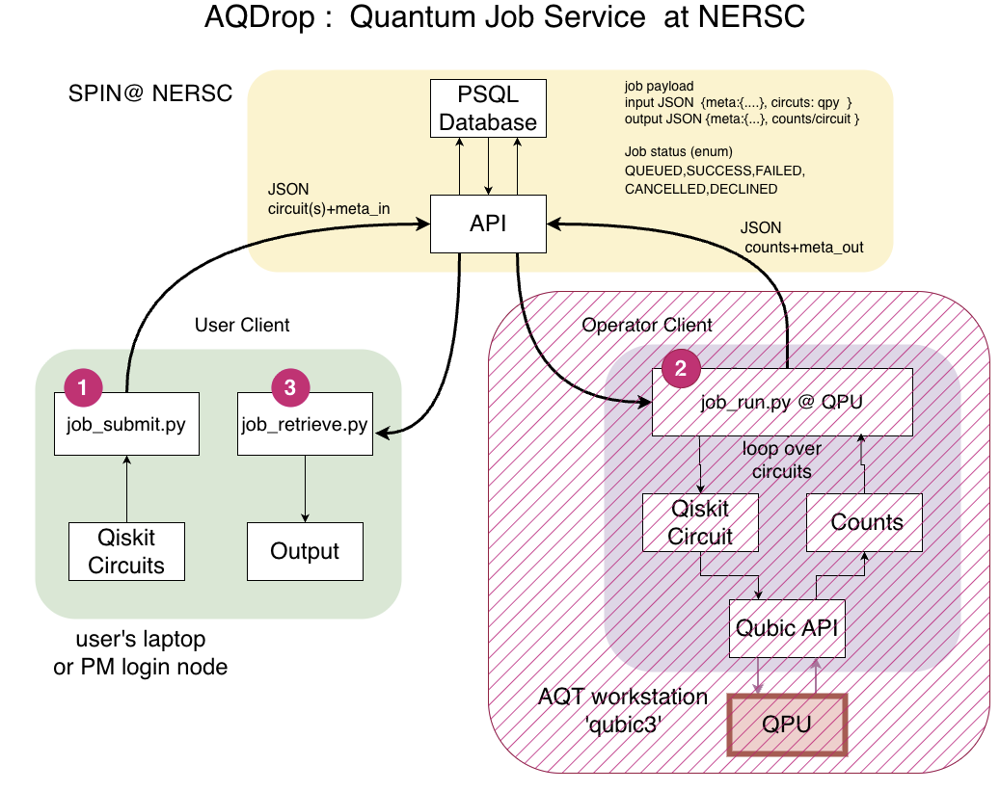

# AQDrop End-User Setup

This guide shows how to set up AQDrop as an end user, submit a minimal Qiskit
job, and retrieve the job record after it has been executed by a privileged
operator. AQDrop is a human-operated API on both ends of the service.



## Prerequisites

Ask the AQDrop service administrator for:

- membership in the NERSC LDAP `aqdrop_users` group
- the AQDrop API hostname

Create a Green SFAPI client for your own NERSC identity in Iris and securely
save its client ID and private key. The authentication section below covers
this one-time setup and token generation.

The server validates the token and derives your NERSC username from its unique
`un:` scope. Do not configure or send a separate AQDrop username. Operator and
administrator access are granted through the independent `aqdrop_operator` and
`aqdrop_admin` LDAP groups.

## Install the Client

AQDrop requires Python 3.12 or newer. Install the client from the NERSC GitHub
repository in a virtual environment:

```bash
python3 -m venv .venv
. .venv/bin/activate
python -m pip install --upgrade pip
python -m pip install "aqdrop @ git+https://github.com/NERSC/aqdrop-client.git@main"
aqdrop --help
```

To use a specific revision, replace `main` with a release tag or commit hash. To
work from a checkout instead:

```bash
git clone https://github.com/NERSC/aqdrop-client.git
cd aqdrop-client
python -m pip install .
```

The basic installation provides the Python SDK, `aqdrop` CLI, and
`aqdrop-generate-sfapi-token`. Install the Qiskit extra when submitting Qiskit
circuits from this checkout:

```bash
python -m pip install ".[qiskit]"
```

At NERSC, `podman-hpc` is the supported container runtime and is used by default
in this guide. On another system, use the container builder/runtime available
there, such as `podman` or Docker, and substitute its command in the examples.

## Configure Authentication

First follow [SFAPI Authentication Setup](sfapi_authentication.md) to create a
**Green** Superfacility API client in Iris, select the correct source-IP range,
and save its client ID and private key. Green is sufficient for AQDrop.

For each session, generate and export a short-lived token with the installed
helper:

```bash
export SFAPI_TOKEN="$(aqdrop-generate-sfapi-token \
  --client-id-file "$HOME/.ssh/aqdrop-sfapi-client-id" \
  --private-key-file "$HOME/.ssh/aqdrop-sfapi-private-key.pem")"
export AQDROP_HOSTNAME=https://aqdrop-api.nersc.gov
```

The helper prints only the token to standard output and does not persist it.
Refresh the token when it expires. Reuse this `SFAPI_TOKEN` for repeated client
commands; this is more efficient than exchanging the private-key credentials
for every call and is the recommended approach when each `podman-hpc run --rm`
invocation starts a new container.

The client also accepts the following two configurations.

Existing SFAPI bearer token:

```bash
export SFAPI_TOKEN=<your-sfapi-token>
export AQDROP_HOSTNAME=https://aqdrop-api.nersc.gov
```

This token is issued by NERSC outside AQDrop. AQDrop does not issue bearer
tokens, and the former AQDrop username/password `/token/` flow is not
supported.

Automatic SFAPI token fetch with client credentials:

```bash
export SFAPI_CLIENT_ID=<your-sfapi-client-id>
export SFAPI_PRIVATE_KEY_PATH=$HOME/.ssh/aqdrop-sfapi-private-key.pem
export AQDROP_HOSTNAME=https://aqdrop-api.nersc.gov
```

In this mode, the client stores the exchanged token in a user-only temporary
cache under `/tmp/aqdrop-<uid>/`. Subsequent client invocations sharing that
temporary filesystem reuse the token until its JWT expiration approaches. If
the API rejects a cached token with `401`, the client removes it, exchanges the
private-key credentials, and retries the request once. Disposable containers
do not share this cache unless a cache filesystem is explicitly persisted, so
pass `SFAPI_TOKEN` to repeated disposable container calls instead.

The SDK also accepts `token=...` directly, or `client_id=...` together with
`private_key_path=...` when you construct `aqdrop.AqdropClient(...)`.

Programmatic examples:

```python
import aqdrop

client = aqdrop.AqdropClient(host="https://aqdrop-api.nersc.gov", token="<sfapi-token>")
```

```python
import aqdrop

client = aqdrop.AqdropClient(
    host="https://aqdrop-api.nersc.gov",
    client_id="<sfapi-client-id>",
    private_key_path="/path/to/private-key.pem",
)
```

In the SFAPI case, the private key should live in a user-private file outside
the repository, not in source control and not embedded in a container image.

> **Credential safety**
>
> - **Keep credentials out of GitHub and out of container images.**
> - **Do not bake credentials into the image.**

Prefer storing credentials in your personal `.ssh` directory and sourcing them
at the start of each session.

For example, create `~/.ssh/aqdrop.creds` with either the existing-token form
or the SFAPI client-credentials form shown above.
Restrict access to the file:

```bash
chmod 600 ~/.ssh/aqdrop.creds
```

Source it when starting an AQDrop session:

```bash
source ~/.ssh/aqdrop.creds
```

For container use, source the credentials on the host and pass the environment
variables into the container at runtime. Prefer generating `SFAPI_TOKEN` once
and passing it into each short-lived container.

If you use the SFAPI client-credential flow inside a container, mount the
private-key file into the container and pass its mounted path through
`SFAPI_PRIVATE_KEY_PATH`.

## Laptop and Workstation Usage

Follow [Install the Client](#install-the-client). To use the repository examples
directly, install the Qiskit extra from the checkout and enter its example
directory:

```bash
git clone https://github.com/NERSC/aqdrop-client.git
cd aqdrop-client
python -m pip install ".[qiskit]"
cd examples
```

## Perlmutter `podman-hpc` Setup

On Perlmutter, a ready AQDrop image may already be available:

```bash
podman-hpc images | grep aqdrop
```

If you need to build the image yourself, use the provided recipe:

```bash
git clone https://github.com/NERSC/aqdrop-client.git
cd aqdrop-client

podman-hpc build \
  -f containers/aqdrop-client.dockerfile \
  -t aqdrop-client:latest .
podman-hpc migrate aqdrop-client:latest
```

The image installs the AQDrop package from the checkout used as its build
context. Its entry point is the `aqdrop` CLI. Generate `SFAPI_TOKEN` on the
host and pass it to the container:

```bash
podman-hpc run --rm \
  -e AQDROP_HOSTNAME \
  -e SFAPI_TOKEN \
  aqdrop-client:latest queue_list
```

For an interactive shell, override the entry point with the option supported by
the local container runtime. Do not include credentials in the image.

## Minimal Example for Submit and Retrieve Quantum Job on AQT QPU Named X6Y3

From the repository example directory:

```bash
cd aqdrop-client/examples
```

Submit a Bell-state job:

```bash
 ./job_submit_bell.py -q X6Y3
```

The submit script prints the assigned job ID, for example:

```text
Job submission successful; assigned job ID 123.
   ./job_retrieve.py --id 123
```

Retrieve the job record with that ID:

```bash
python3 job_retrieve.py --id 123
```

If the job is still queued, the retrieve script prints:

```text
no results available yet
```

Wait and run the same retrieve command again. Use higher verbosity to inspect
more detail:

```bash
 ./job_retrieve.py --id 123 -v 2
 ./job_retrieve.py --id 123 -v 3
```

`-v 2` prints the packed Qiskit circuits. `-v 3` prints the full returned job
record.

## Notes

Use the AQDrop CLI to inspect queues and jobs:

```bash
aqdrop queue_list
aqdrop job_list
```

`aqdrop queue_list` lists available queues. `aqdrop job_list` lists your jobs
and their status.

The CLI uses the same auth resolution as the Python SDK:

- `SFAPI_TOKEN` if you already have a bearer token
- otherwise `SFAPI_CLIENT_ID` plus `SFAPI_PRIVATE_KEY_PATH`

Authentication and authorization failures are reported separately: `401`
means the SFAPI credential was rejected, `403` means the validated identity
lacks the required LDAP group, and `503` means live LDAP authorization was
unavailable.

`examples/job_submit_bell.py` submits immediately. The larger
`examples/job_submit.py` script prepares a multi-circuit example and only
submits when `-E` is provided:

```bash
 ./job_submit.py -q <queue-name>
 ./job_submit.py -q <queue-name> -E
```
